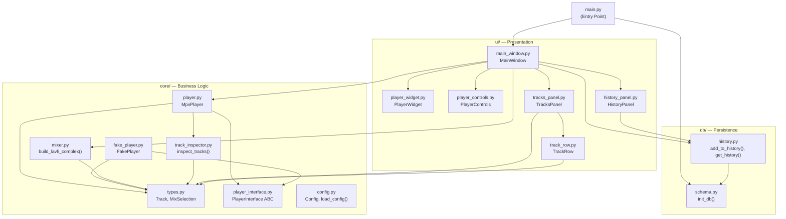
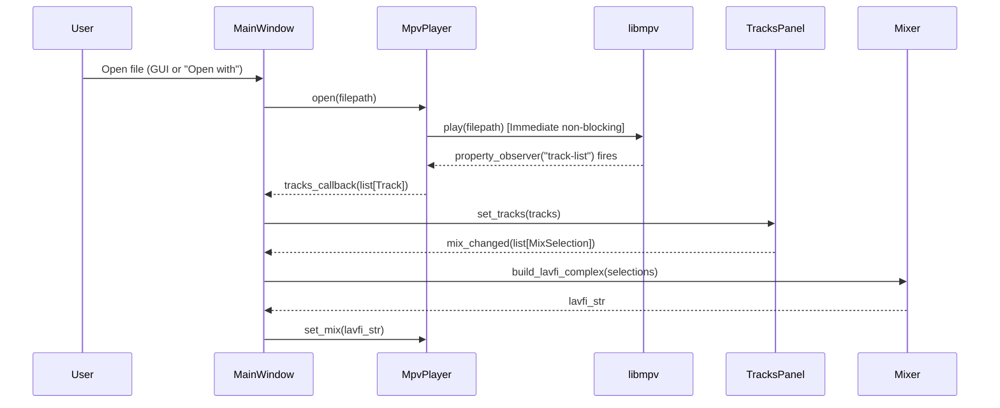

# Architecture — Frostplay

## Overview

Frostplay is built following **clean architecture** principles with a clear separation into three layers: **core** (business logic), **db** (persistence), **ui** (presentation). Each layer is isolated and communicates through well-defined contracts.

## Project Structure

```
Frostplay/
├── main.py                      # Entry point
├── pyproject.toml               # ruff, mypy, pytest configuration
├── requirements.txt             # Dependencies
├── config.example.json          # Example configuration
├── mpv-2.dll                    # libmpv library (Windows)
├── ffprobe.exe                  # FFprobe utility (Windows)
│
├── core/                        # Business logic (no UI dependencies)
│   ├── types.py                 # Shared types: Track, MixSelection, MixPreset
│   ├── player_interface.py      # ABC player interface
│   ├── player.py                # Real implementation via python-mpv
│   ├── fake_player.py           # Test implementation without libmpv
│   ├── mixer.py                 # Builds lavfi-complex string for audio mixing
│   ├── track_inspector.py       # Extracts audio tracks via ffprobe
│   └── config.py                # Loads configuration from JSON
│
├── db/                          # Persistence layer (SQLite)
│   ├── schema.py                # DB schema initialization and migration
│   └── history.py               # CRUD for the history table
│
├── ui/                          # Presentation layer (PyQt6 + QFluentWidgets)
│   ├── main_window.py           # Main window, navigation, orchestration
│   ├── player_widget.py         # Video rendering widget (mpv wid)
│   └── components/              # Reusable UI components
│       ├── player_controls.py   # Play/pause, slider, time, buttons
│       ├── tracks_panel.py      # Floating audio mixer panel
│       ├── track_row.py         # Individual track row with volume slider
│       └── history_panel.py     # Recently opened files panel
│
├── tests/                       # Tests (pytest + pytest-qt)
│   ├── fixtures/                # Test fixtures
│   ├── test_mixer.py            # lavfi-complex builder tests
│   ├── test_player.py           # MpvPlayer tests (with mocks)
│   ├── test_track_inspector.py  # ffprobe parsing tests
│   ├── test_tracks_panel.py     # Mixer UI component tests
│   ├── test_history.py          # History CRUD tests
│   └── test_ui_smoke.py         # Smoke test for main window creation
│
├── docs/                        # Documentation
└── .github/workflows/ci.yml     # GitHub Actions CI pipeline
```

## Dependency Diagram



## Data Flow



## Key Architectural Decisions

### 1. Player Interface (Strategy Pattern)

`PlayerInterface` is an abstract base class that defines the player contract. Two implementations:

- **`MpvPlayer`** — real player via python-mpv + libmpv
- **`FakePlayer`** — test stub for CI and unit tests without GPU/display

This allows developing and testing the UI without a real video file.

### 2. Deferred MPV Initialization & Async Property Observers

- MPV is initialized only after `showEvent()` of the main window via `QTimer.singleShot(0, ...)` to guarantee that `winId()` is already valid (native window has been created).
- **Asynchronous Track Extraction:** Instead of synchronously spawning external `ffprobe` processes during `open()` (which previously caused 5-7 second UI freezes), `MpvPlayer` listens to `libmpv`'s native `track-list` property observer. Audio tracks are parsed on-the-fly and delivered to the UI without blocking the Qt event loop.

### 3. Single-Instance IPC Architecture

Frostplay uses `QLocalServer` / `QLocalSocket` for cross-process communication. When a user double-clicks a video or uses "Open with" while Frostplay is already running, the new process sends the file path over the IPC channel to the primary instance and terminates immediately, eliminating redundant process startup overhead.

### 4. Floating Panel (Tool Window)

`TracksPanel` uses `Qt.WindowType.Tool | Qt.WindowType.FramelessWindowHint`:
- Does not block the main window (unlike `Dialog`/`Popup`)
- Can be dragged with the mouse
- Displayed above the player

### 5. lavfi-complex Mixing

Audio track mixing happens at the libmpv level through the `lavfi-complex` filter graph. The `mixer.py` module builds the filter string in a purely functional manner, without side effects.

### 6. Lazy Loading for Heavy UI Components

The `HistoryPanel` defers heavy item population until the user actually switches to the History tab, preventing unnecessary widget creation and disk access during initial application launch.


## External Dependencies

| Dependency | Version | Purpose |
|------------|---------|---------|
| PyQt6 | ≥6.6.0 | GUI framework |
| PyQt6-Fluent-Widgets | ≥1.5.0 | Fluent Design components |
| python-mpv | ≥1.0.5 | libmpv bindings |
| mpv-2.dll | — | Video rendering (Windows) |
| ffprobe | — | Audio track analysis |

## Binary Dependencies

On Windows, `mpv-2.dll` and `ffprobe.exe` must be placed in the project root directory. `main.py` automatically adds the current directory to `PATH` and calls `os.add_dll_directory()` for proper DLL loading.
