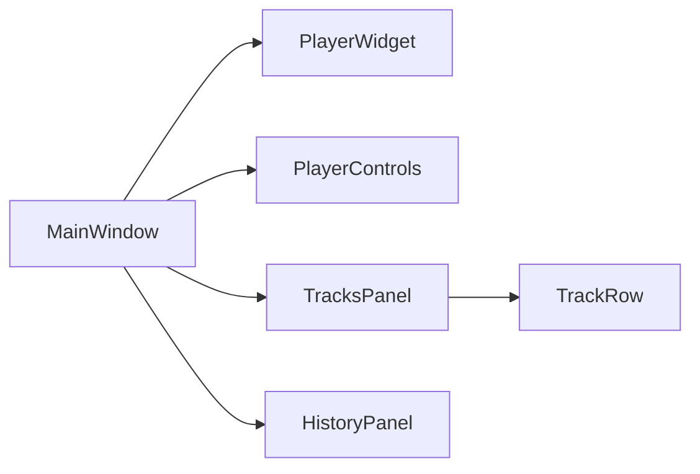

# UI Components — Frostplay

Reference guide for all UI components: what each does, which signals it emits, and how they interact.

## Component Overview



---

## MainWindow

**File:** `ui/main_window.py`  
**Base class:** `FluentWindow` (qfluentwidgets)

The main application window. Contains page navigation (Player, History, Settings) and orchestrates all other components.

### Navigation

Left sidebar with icons:
- 🎬 **Player** (TOP) — main screen with video
- 📜 **History** (TOP) — recently opened files list
- ⚙️ **Settings** (BOTTOM) — placeholder for future settings

> "Menu" and "Back" buttons are hidden (`setMenuButtonVisible(False)`, `setReturnButtonVisible(False)`).

### Signal Connections

```
PlayerWidget.clicked             → _on_play_pause()
PlayerControls.play_pause_clicked → _on_play_pause()
PlayerControls.seek_requested    → _on_seek()
PlayerControls.open_requested    → _on_open_video()
PlayerControls.btn_tracks.clicked → _show_tracks_menu()
TracksPanel.mix_changed          → _on_mix_changed()
TracksPanel.master_volume_changed → _on_master_volume_changed()
HistoryPanel.file_selected       → _on_history_file_selected()
```

---

## PlayerWidget

**File:** `ui/player_widget.py`  
**Base class:** `QWidget`

A black rectangle into which mpv's native window is embedded. Its `winId()` is passed to `MpvPlayer` during initialization.

### Signals

| Signal | Type | When it fires |
|--------|------|---------------|
| `clicked` | `()` | Left mouse button click on the video area |

---

## PlayerControls

**File:** `ui/components/player_controls.py`  
**Base class:** `QWidget`

Bottom control bar for the player.

### Elements

| Element | Type | Description |
|---------|------|-------------|
| `btn_play` | `ToolButton` | Play/Pause (icon changes dynamically) |
| `slider` | `ClickableSlider` | Timeline — seek by click and drag |
| `time_label` | `BodyLabel` | Current time / duration (MM:SS / MM:SS) |
| `btn_tracks` | `ToolButton` | Opens/closes TracksPanel |
| `btn_open` | `ToolButton` | File open dialog |

### Signals

| Signal | Type | When it fires |
|--------|------|---------------|
| `play_pause_clicked` | `()` | Click on btn_play |
| `seek_requested` | `(float)` | Slider moved (value in seconds) |
| `open_requested` | `()` | Click on btn_open |

### Control State

On app startup, all controls are **disabled** except the Open button. They are automatically enabled when `set_duration()` is called with `duration > 0`.

### ClickableSlider

Custom slider (`Slider` from qfluentwidgets) that immediately jumps to the click position rather than requiring the handle to be dragged.

---

## TracksPanel

**File:** `ui/components/tracks_panel.py`  
**Base class:** `QFrame`

Floating panel for managing audio tracks.

### Window Type

`Qt.WindowType.Tool | Qt.WindowType.FramelessWindowHint`

This ensures:
- The panel does not block the main window (non-modal)
- No standard title bar — replaced with a custom one with a close button
- Can be dragged by any part of the panel

### Elements

| Element | Type | Description |
|---------|------|-------------|
| Title | `SubtitleLabel` | "Audio Tracks" |
| btn_close | `ToolButton` | Close the panel |
| Master Volume | `Slider` + `CaptionLabel` | Master volume 0–100% |
| ScrollArea | `SmoothScrollArea` | Scrollable list of TrackRow widgets |

### Signals

| Signal | Type | When it fires |
|--------|------|---------------|
| `mix_changed` | `(list[MixSelection])` | Any change in track rows |
| `master_volume_changed` | `(int)` | Master volume slider changed |

### Positioning

The panel appears above the Tracks button, right-aligned. Position is calculated via `mapToGlobal()` in `MainWindow._show_tracks_menu()`.

---

## TrackRow

**File:** `ui/components/track_row.py`  
**Base class:** `SimpleCardWidget` (qfluentwidgets)

Card for an individual audio track. Consists of two rows:

### Top Row
- `CheckBox` — enable/disable the track
- `IconWidget(MUSIC)` — icon
- `BodyLabel` — "Track N (lang, codec)"

### Bottom Row
- `IconWidget(VOLUME)` — volume icon
- `Slider` — volume 0–100%
- `CaptionLabel` — percentage or "Off"

### Signals

| Signal | Type | When it fires |
|--------|------|---------------|
| `state_changed` | `()` | Volume or enabled state changed |

### Behavior

- When checkbox is unchecked → slider is disabled, text turns gray, shows "Off"
- When checkbox is checked → slider is active, text is white, shows "N%"

---

## HistoryPanel

**File:** `ui/components/history_panel.py`  
**Base class:** `QFrame`

Page with a list of recently opened files.

### Elements

| Element | Type | Description |
|---------|------|-------------|
| Title | `QLabel` | "Recent Files" |
| list_widget | `ListWidget` | File list (qfluentwidgets) |

### Signals

| Signal | Type | When it fires |
|--------|------|---------------|
| `file_selected` | `(str)` | Double-click on a list item |

### Auto-loading
 
The panel loads history when initialized, when the user navigates to the History tab, and after `_open_file()` calls in MainWindow.
 
---
 
## SettingsPanel
 
**File:** `ui/components/settings_panel.py`  
**Base class:** `SimpleCardWidget` (qfluentwidgets)
 
Page providing user configurations.
 
### Elements
 
| Element | Type | Description |
|---------|------|-------------|
| folder_edit & browse_btn | `LineEdit` + `PushButton` | Select default directory for video file dialogs |
| preview_checkbox | `CheckBox` | Toggle thumbnail previews in history |
| wheel_vol_checkbox | `CheckBox` | Toggle mouse wheel volume adjustment |
| vol_boost_checkbox | `CheckBox` | Enable master volume boost up to 200% |
| blanket_fill_checkbox | `CheckBox` | Toggle Blanket Fill ambient blur mode |
 
### Signals
 
| Signal | Type | When it fires |
|--------|------|---------------|
| `history_preview_changed` | `(bool)` | History previews checkbox changed |
| `volume_boost_changed` | `(bool)` | 200% volume boost checkbox changed |
| `wheel_volume_changed` | `(bool)` | Mouse wheel volume checkbox changed |
| `blanket_fill_changed` | `(bool)` | Blanket Fill checkbox changed |
 
---
 
## Creating a New Component


### Template

```python
from PyQt6.QtCore import pyqtSignal
from PyQt6.QtWidgets import QWidget
from qfluentwidgets import SimpleCardWidget


class MyComponent(SimpleCardWidget):  # type: ignore
    # Define signals
    something_happened = pyqtSignal(str)

    def __init__(self, parent: QWidget | None = None) -> None:
        super().__init__(parent)
        # Initialize UI elements
        ...

    def public_method(self) -> None:
        """Public method for external use."""
        ...
        self.something_happened.emit("data")
```

### Checklist

- [ ] Component is in `ui/components/`
- [ ] Uses qfluentwidgets components
- [ ] Communication via `pyqtSignal`
- [ ] Doesn't know about other components
- [ ] `setFocusPolicy(Qt.FocusPolicy.NoFocus)` on buttons/sliders
- [ ] Test written in `tests/`
